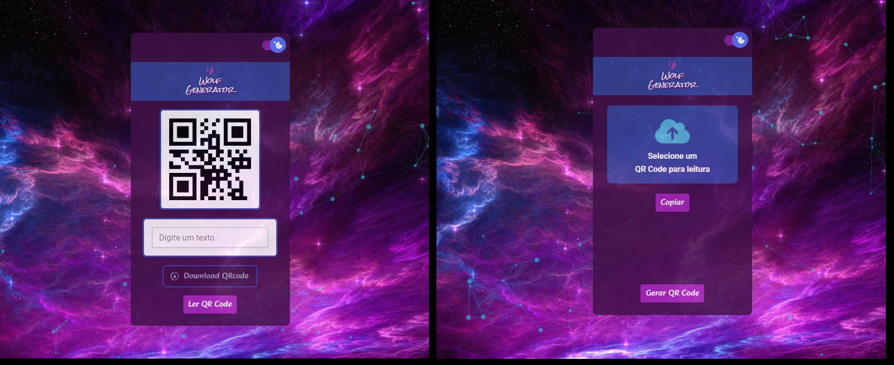

Projeto para gerar QR code apartir de um texto e ler um QR code apartir de uma imagem enviada

# Estou usando React + Vite

[](https://www.loom.com/share/23d4798a8c4640708469c5f195270ab5)
[Assista à demonstração aqui](https://www.loom.com/share/23d4798a8c4640708469c5f195270ab5)

Esta hospedado aqui: https://gerador-qr-code-lli3wprch-leoo1992.vercel.app/

# Como Iniciar : 


## Passo 1: 

* Clonar esse repositório com:

```bash
git clone https://github.com/leoo1992/GeradorQRCode.git
```

## Passo 2: Iniciando o Aplicativo

```bash
# usando npm
npm install
npm start


# Ou usando Yarn
yarn add
yarn start
```

Agora você deverá ver seu o aplicativo em execução local no seu navegador.

# Foto do app: 
 
